

    

        <h3 class="title-section">
            Contexto
            <i class="line mt-65 mb-30"></i>
        </h3>
    

    

        <h3 class="title-second mb-30">
            Assis foi pensado para um desafio de processo seletivo. O desafio era criar algo que revolucionasse
            entregas.
        </h3>
        
Para este desafio pensei no Assis, como uma forma de gerenciar compras em mercados e feiras locais,
        como se o usuário estivesse pedindo a alguém as suas compras, como numa conversa, porém esta conversa
        seria feita por meio de um chatbot.

    

    

        <h3 class="title-section">
            Visão Geral
            <i class="line mt-65 mb-30"></i>
        </h3>
        
Pensei em um chatbot como proposta atual de interação com o meio digital, porém implementando
            elementos de interface conhecidos pela maioria dos usuários atualmente.
        

    

    

        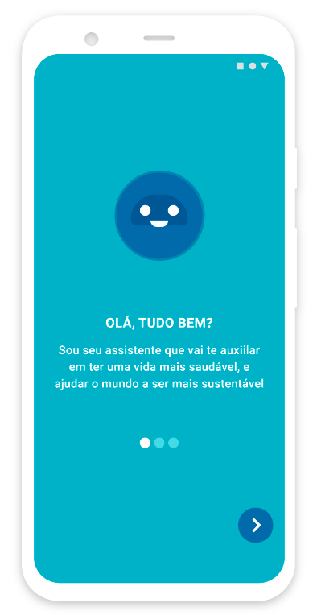
    

    

        <h3 class="title-section">
            Primeiro acesso
            <i class="line mt-65 mb-30"></i>
        </h3>
        

            Começando com uma splash screen explicativa, em três passos é 
            explicado o funcionameto do ecossitema da plataforma.
        

    

    

        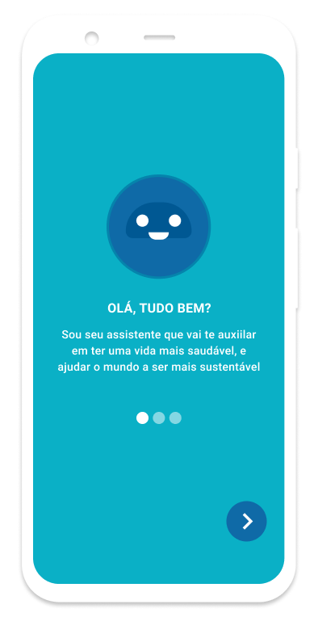
    

    

        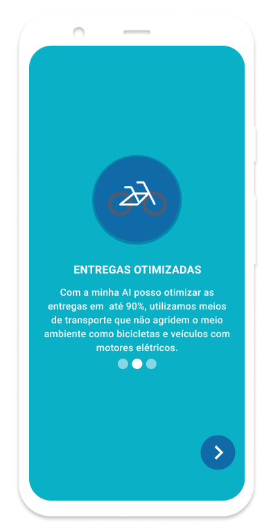
    

    

        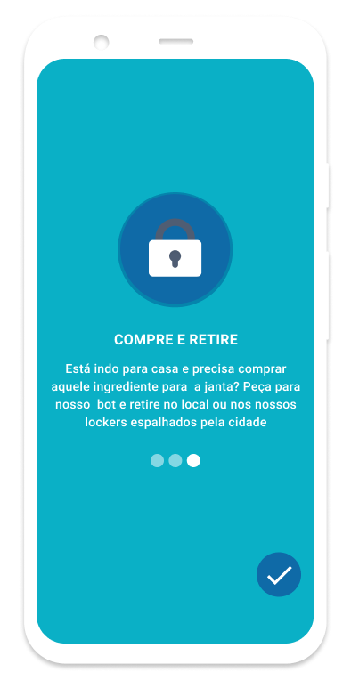
    

    

        <h3 class="title-section">
            Compre pelo chat
            <i class="line mt-65 mb-30"></i>
        </h3>
        

            Fazendo o login ou cadastrando-se no app o usuário pode escolher entre algumas
            ações no topo do aplicativo que são, retirar encomendas, entregas rápidas e explorar as suas opções de compra.
            Logo abaixo mostro os comércios mais próximos encotrandos com base na sua localização atual, no final do app 
            temos uma caixa de texto, onde o usuário poderá pedir ao assistente qualquer produto ou serviço. No próprio chat
            o usuário vai confirmando seus itens comprados, editando, excluindo, finalizando e pagando sua compra.
        

    

    

        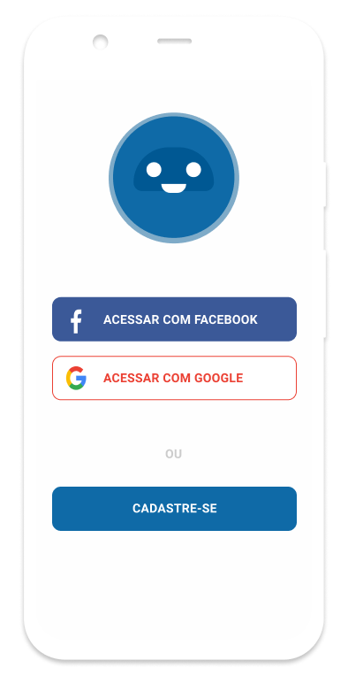
    

    

        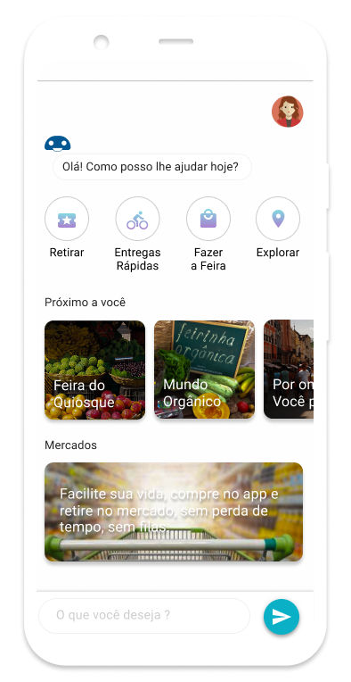
    

    

        
    

    

        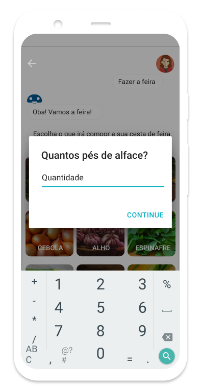
    

    

        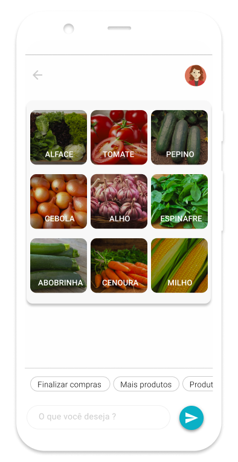
    

    

        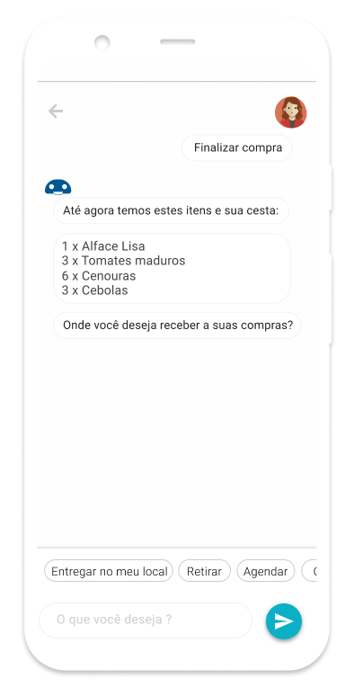
    

    

        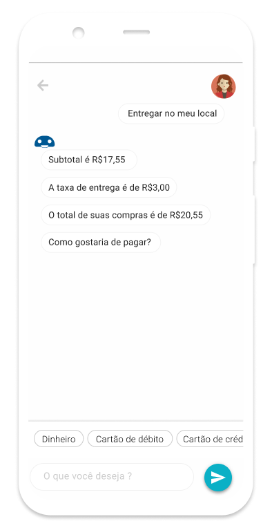
    

    

        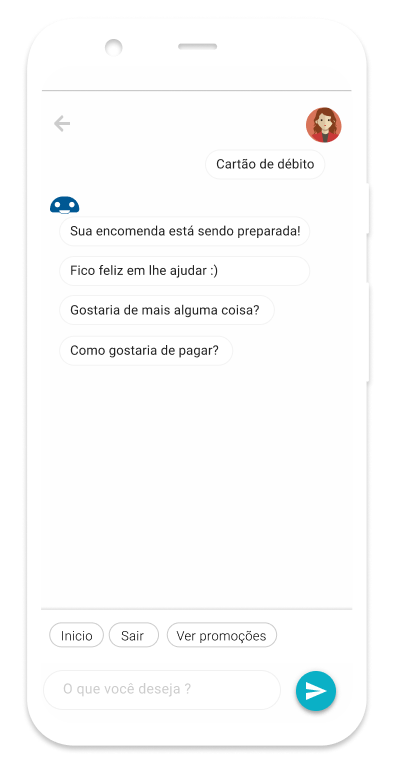
    

