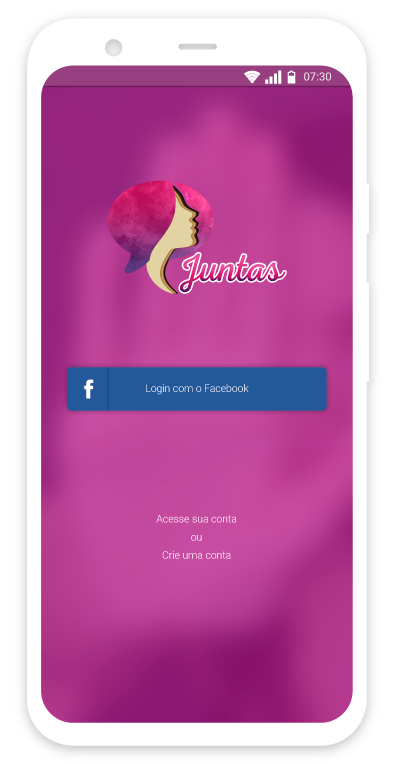
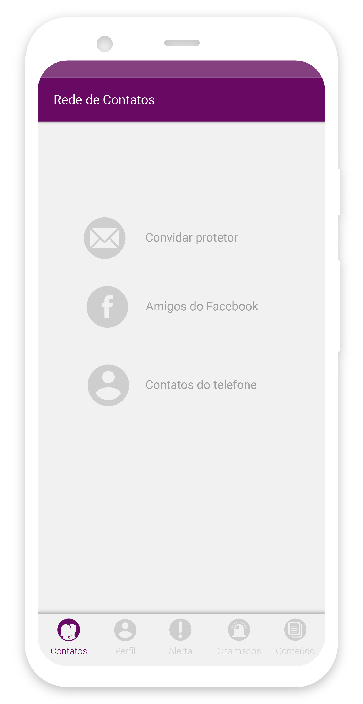
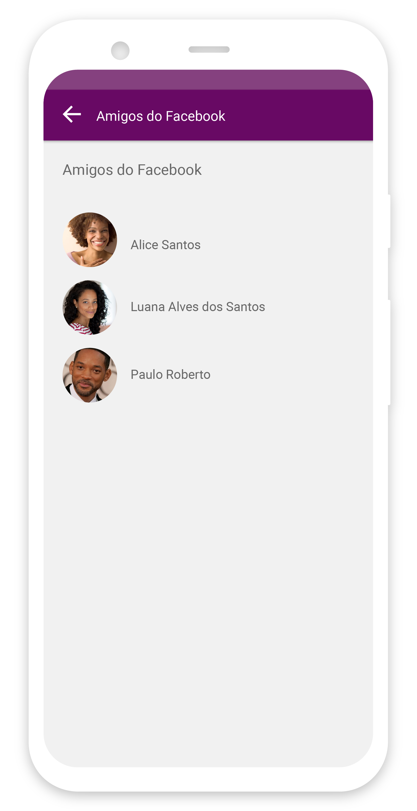
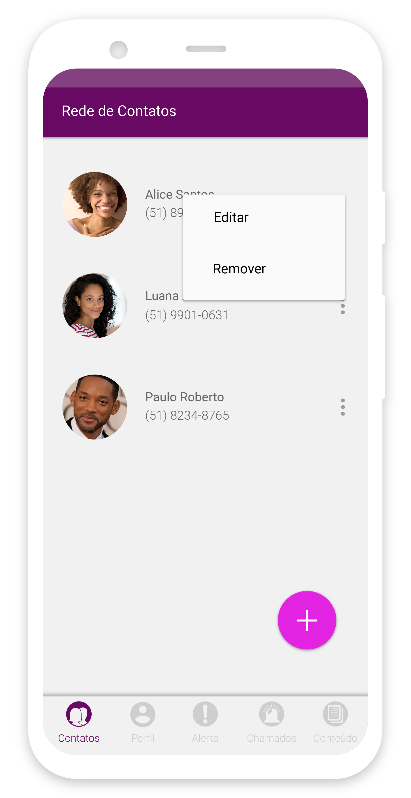
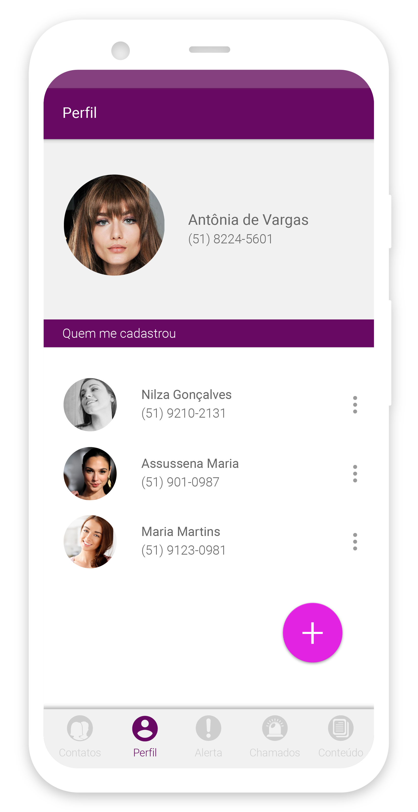
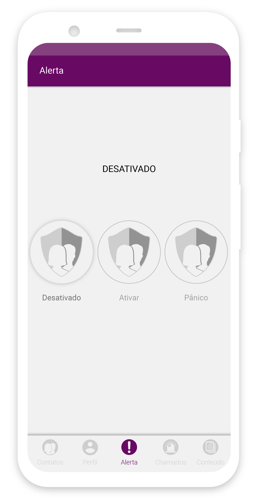
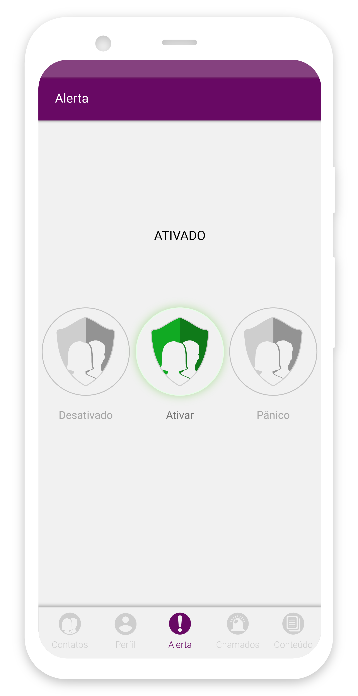
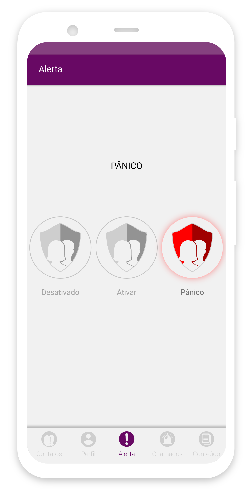
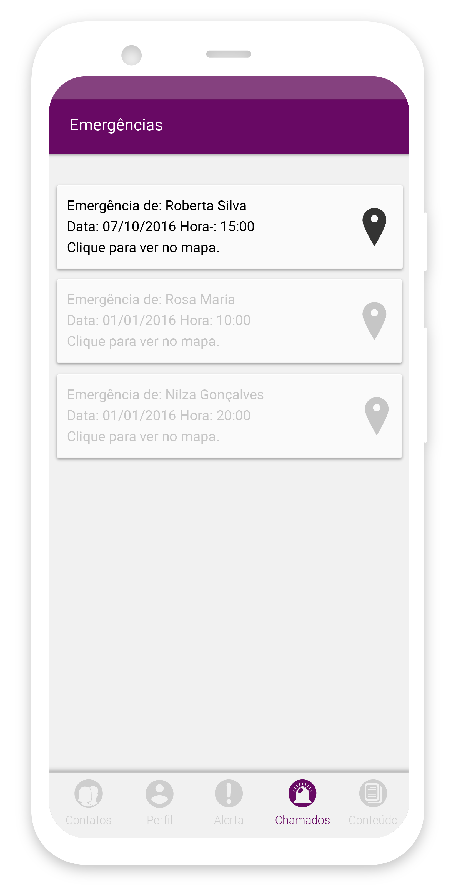

    

        <h3 class="title-section">
            Contexto
            <i class="line mt-65 mb-30"></i>
        </h3>
    

    

        <h3 class="title-second mb-30">
            Juntas é um aplicativo criado para auxiliar no combate a violência contra
            a mulher. O app consiste em criar uma rede de proteção entre seus contatos.
        </h3>
        
Desenvolvido para ter um funcionamento simples o usuário cadastra uma lista de contatos, 
        onde o aplicativo quando acionado, mandará um alerta com a localização e uma mensagem 
        predefinida, abrindo um chat com a rede de proteção já criada.

    

    

        <h3 class="title-section">
            Visão Geral
            <i class="line mt-65 mb-30"></i>
        </h3>
        
Afim de corrigir fluxos de uso, e modernizar a interface, realizei o redesign e o fluxo de uso, para oferecer uma melhor experiência
            aos usuários. Utilizei neste projeto o Adobe illustrator e invision, para criar a interface, fluxo de navegação, e as novas interações do app.
        

    

    

        
    

    

        <h3 class="title-section">
            Rede de contatos
            <i class="line mt-65 mb-30"></i>
        </h3>
        

            No primeiro acesso do aplicativo o usuário poderá cadastrar no máximo três contatos
            por meio do compartilhamento de um link, este link serve para fazer download e cadastrar-se no app.
            O link é enviado por meio do e-mail ou sms, e também é possivel convidar os amigos do facebook para fazer parte de sua rede.
        

    

        

            
        

        

            
        

        

            
        

    

        <h3 class="title-section">
            Perfil
            <i class="line mt-65 mb-30"></i>
        </h3>
        

            Em seu perfil, o usuário pode excluir um contato, editar estes contato, e cadastrar novos
            contatos, respeitando o limite de três contatos. O usuário ainda pode ver suas informações e
            quais pessoas cadastraram a sua conta como contato.
        

    
  
    

        
    

    

        
    

    

        
    

    

        <h3 class="title-section">
            Dispositivo de Alerta
            <i class="line mt-65 mb-30"></i>
        </h3>
        

            O dispotivo de alerta tem três estados de ativação. O primeiro deles é DESATIVADO, onde 
            o alerta não será disparado após três toques no botão de liga/desliga do telefone. O segundo
            estado é ATIVADO, aqui o aplicativo está pronto para ser acionado após três toques consecutivos, enviando
            um sms/alerta para os contatos cadastrados. O último estado é o PÂNICO, quando este estado é ativado ele automaticamente
            envia um sinal de alerta para os usuários cadastrados em sua conta do aplicativo.
        

    

    

        
    

    

        
    

    

        
    

        <h3 class="title-section">
            Chat de alerta
            <i class="line mt-65 mb-30"></i>
        </h3>
        

            No envio do alerta é aberto um chat, neste chat é enviado uma mensagem padrão
            e a localização do dispositivo do usuário que disparou o alerta, iniciando um chat com 
            os contatos cadastrados.
        

    

    

        
    

    

        
    

