

    

        <h3 class="title-section">
            Contexto
            <i class="line mt-65 mb-30"></i>
        </h3>
    

    

        <h3 class="title-second mb-30">
            Laudelina é um aplicativo que foi desenvolvido voltado a empregadas domésticas,
            diaristas e faxineiras, para que elas se apoderem de seus direitos, deixando
            assim a relação entre empregada e empregador mais transparente.
        </h3>
        
O Laudelina é um projeto idealizado pela ONG Themis, que atua na promoção de uma 
            rede de apoio e enfrentamento as desigualdades raciais, socioeconômicas e culturais.

    

    

        <h3 class="title-section">
            Visão Geral
            <i class="line mt-65 mb-30"></i>
        </h3>
        
A interface foi construída pensando na simplicidade de cards informativos, ilustrados por ícones que remetiam
        aos títulos dos mesmos, dando um destaque maior para os direitos que o usuário tem como empregada, e calculadora de 
        salários, que é uma ferramenta importante para calcular os seus ganhos.

    

    

        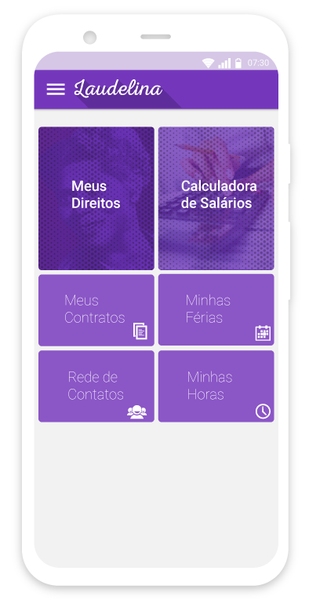
    

    

        <h3 class="title-section">
            Direitos
            <i class="line mt-65 mb-30"></i>
        </h3>
        

            Acessando o menu de direitos o usuário encontra os direitos separados por categorias. Passando para a tela
            do assunto escolhido o usuário acessa a versão do texto da lei que prevê aquele item em específico.
        

    

    

        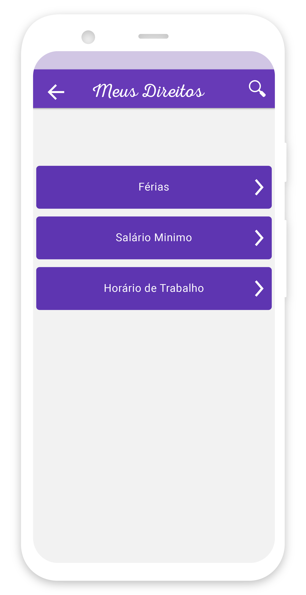
    

    

        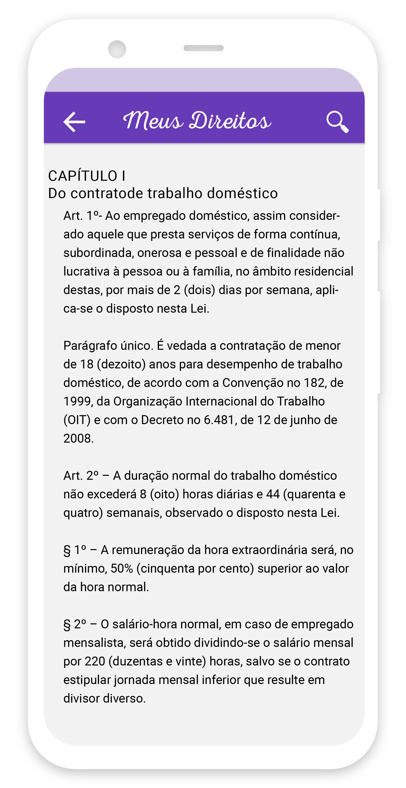
    

    

        <h3 class="title-section">
            Contratos
            <i class="line mt-65 mb-30"></i>
        </h3>
        

            Na gestão de contratos o usuário pode adicionar a quantidade necessária de contratos. A adição de contrato
            é um formulário simples, o usuário precisa informar o nome da pessoa que está contratando os seus serviços, 
            a data a qual ela vai iniciar, os dias os quais ela irá trabalhar e a quantidade de horas, o salário, que pode
            ser calculado na calculadora de salários do próprio app, a data de pagamento e seus dias de férias por lei.
        

    

    

        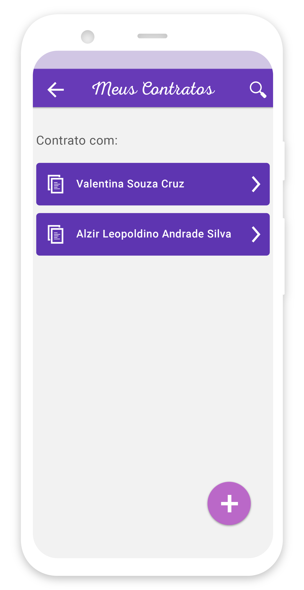
    

    

        
    

    

        <h3 class="title-section">
            Salários e Férias
            <i class="line mt-65 mb-30"></i>
        </h3>
        

            Calculadora de salário e férias. 
            O cálculo de salário pode ser feito em cima de um contrato existente e das horas extras
            trabalhadas para este contrato. Em uma única tela o usuário pode calcular e confirmar o 
            valor de suas férias e confirmar o período de descanso assegurado por lei.
        

    

    

        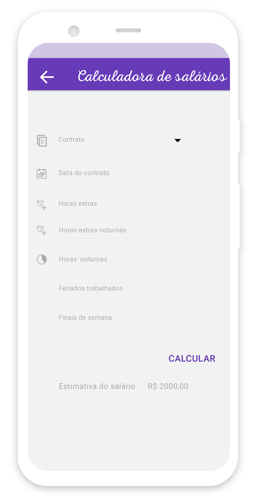
    

    

        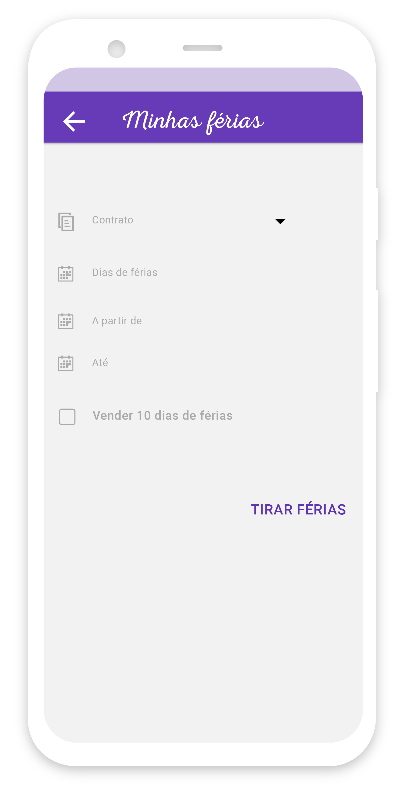
    

    

        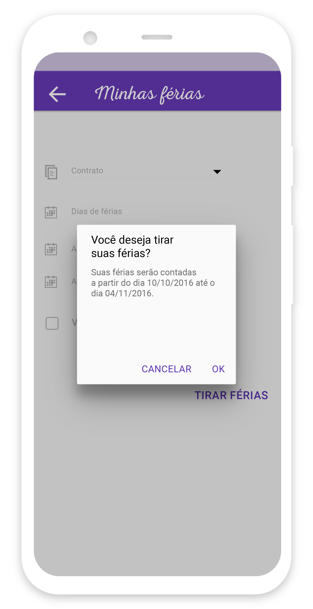
    

    

        <h3 class="title-section">
            Controle de horas
            <i class="line mt-65 mb-30"></i>
        </h3>
        

            O aplicativo conta com um controle de horas normais e horas extras para que o usuário
            apresente isto a seu empregador, garantindo que a sua carga horário normal e extra 
            seja remunerada de forma justa.
        

    

    

        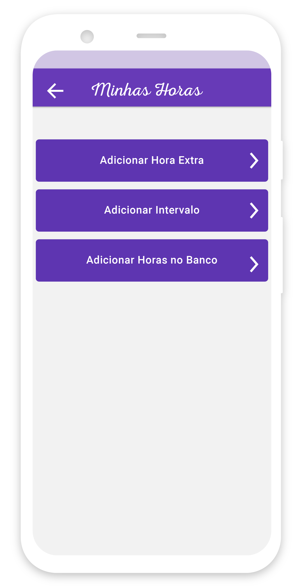
    

    

        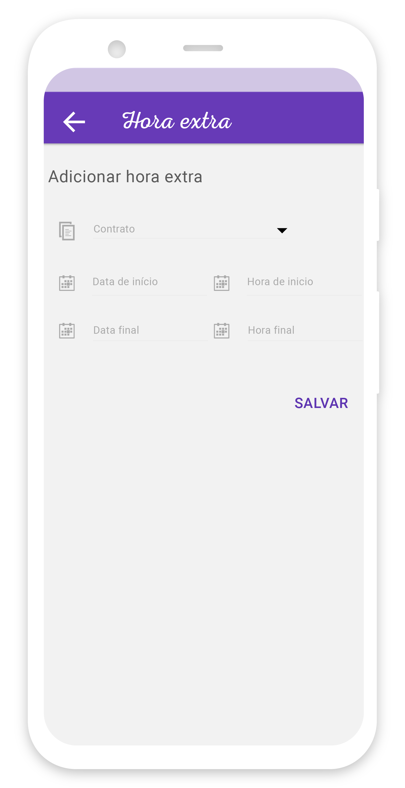
    

    

        <h3 class="title-section">
            Rescisão
            <i class="line mt-65 mb-30"></i>
        </h3>
        

            O aplicativo conta também com uma simulação de rescisão contratual, contemplando todas
            as etapas juridicas e suas particularidades.
        

    

    

        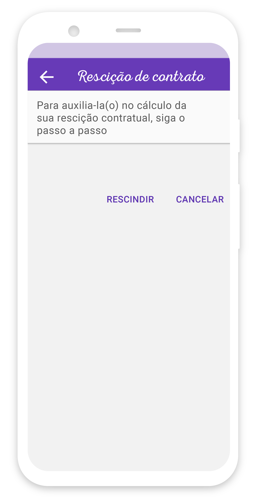
    

    

        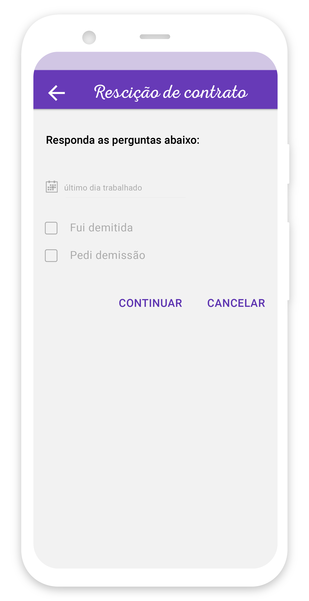
    

    

        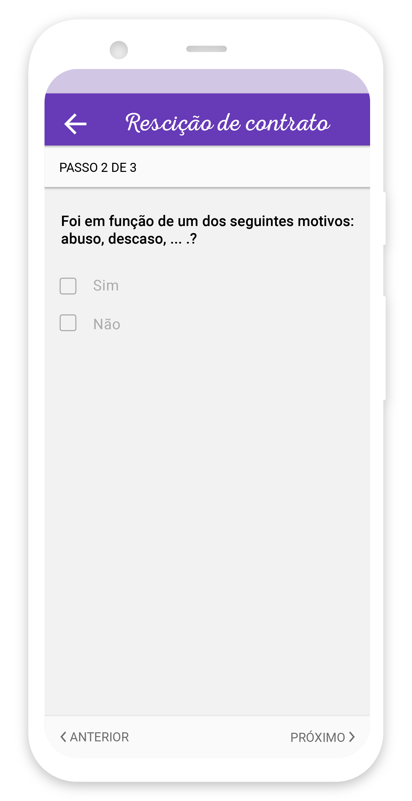
    

    

        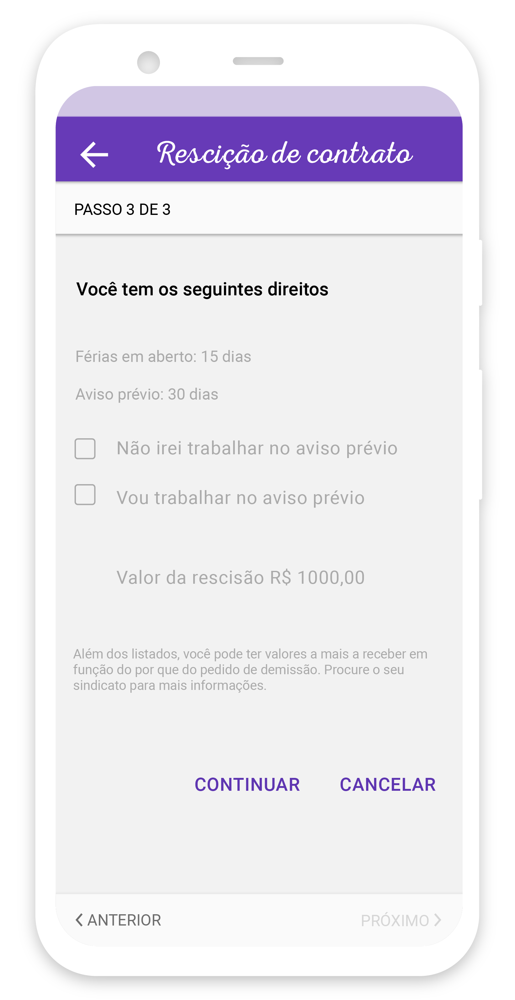
    

    

        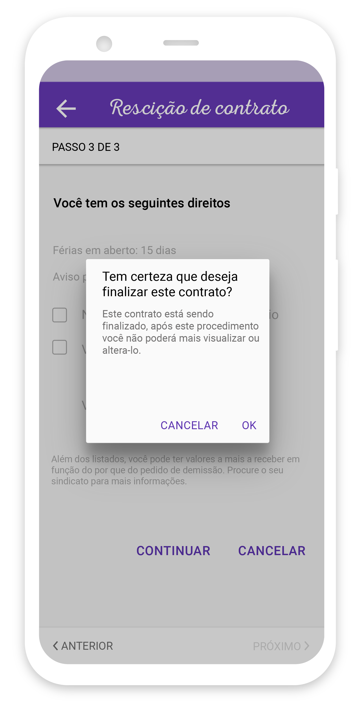
    

    

        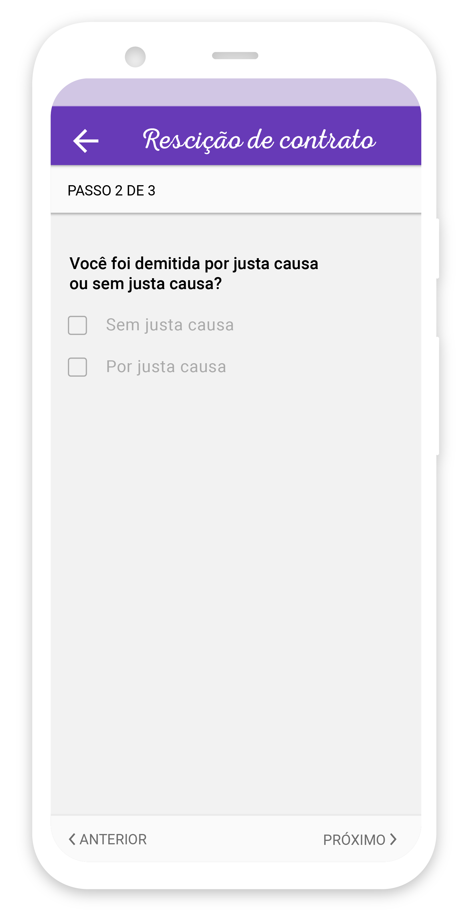
    

    

        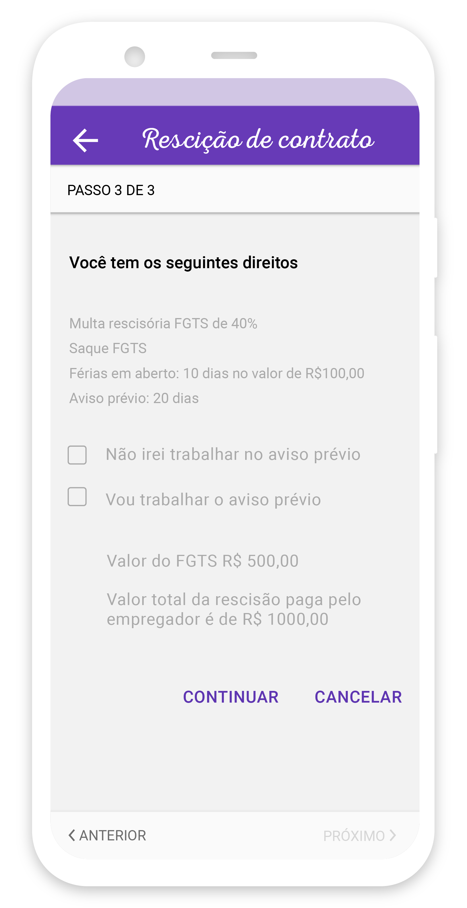
    

    

        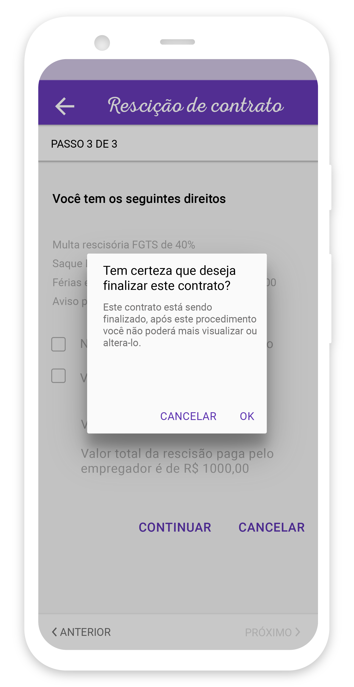
    

