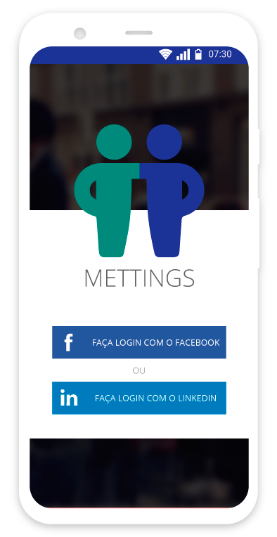
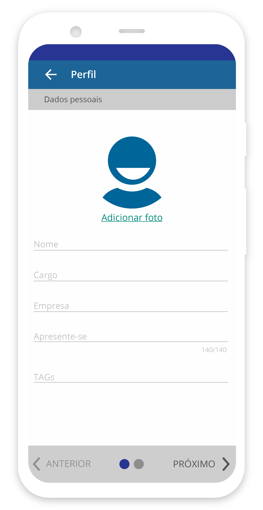
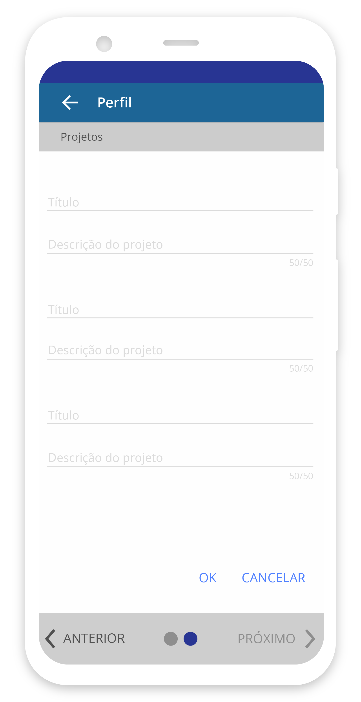
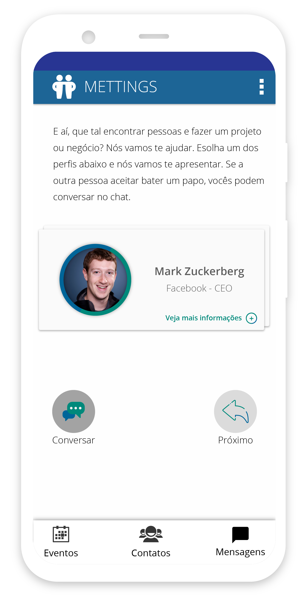
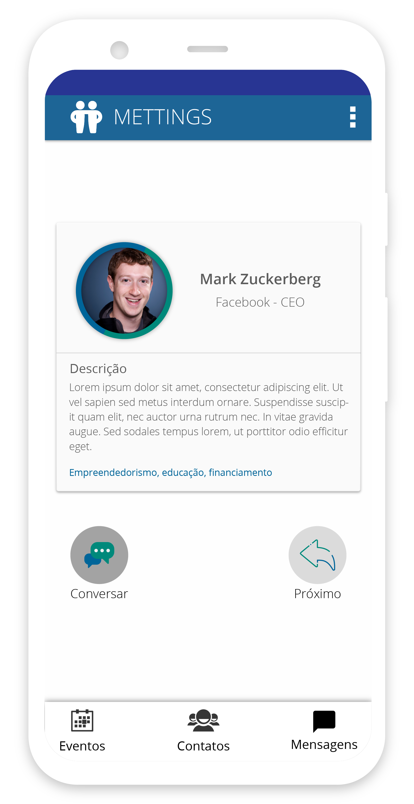

    

        <h3 class="title-section">
            Contexto
            <i class="line mt-65 mb-30"></i>
        </h3>
    

    

        <h3 class="title-second mb-30">
            Mettings é um MVP de app, que foi desenvolvido pensando em encontros de 
            negócios nos eventos.
        </h3>
        
Para agregar valor aos eventos e facilitar a criação de networking foi criado este
           MVP de aplicativo que serveria como cartão virtual, conectando pessoas que estivem
           no mesmo espaço físico e troca de contatos no meio virtual.
        

    

    

        <h3 class="title-section">
            Visão Geral
            <i class="line mt-65 mb-30"></i>
        </h3>
        
Pensado para melhorar a criação de networking em eventos, e minimizar o desperdício de
        papel com cartões de visita físicos, foi criado este protótipo para ser utilizado em eventos
        presenciais. Facilitando o cadastro de seus contatos e a conexão com pessoas de seu interesse
        

    

    

        
    

    

        <h3 class="title-section">
            O App
            <i class="line mt-65 mb-30"></i>
        </h3>
        

        Pensando em uma forma simples do usuário criar o seu cartão de visitas virtual
        ele passa por um cadastro de duas etapas. Após este cadastro, o usuário ativa o aplicativo
        no evento que estiver, para que seja possível encontrar usuário próximos que estejam cadastrados
        no app e assim façam a troca de contatos criando uma network.
        

    

    

        
    

    

        
    

    

        
    

    

        
    

