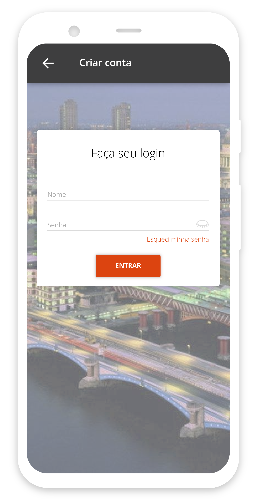
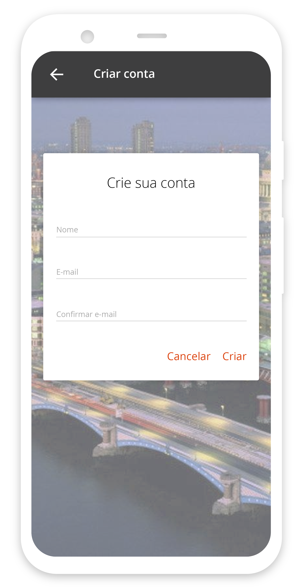
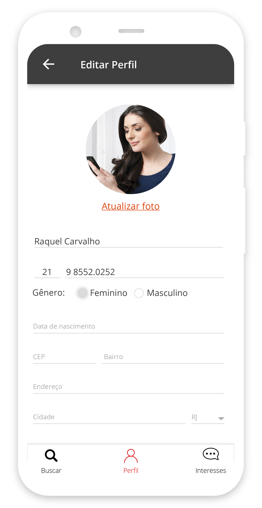

        <h3 class="title-section">
            Contexto
            <i class="line mt-65 mb-30"></i>
        </h3>
    

    

        <h3 class="title-second mb-30">
            O projeto TeachR é uma plataforma que tem o objetivo de conectar professores
            e alunos que os procurem por quaisquer matérias. 
        </h3>
        
Os alunos utilizam o app para procurar por professores, 
            enquanto os professores utilizam o dashboard no seu navegador para se cadastrar e gerenciar suas aulas e alunos.

    

        <h3 class="title-section">
            Visão Geral
            <i class="line mt-65 mb-30"></i>
        </h3>
        
Construído um MVP para IOs e Android, este projeto foi pautado através de 
            personas, construídas com pesquisa e intrevistas a profissionais da área de
            educação.
        

    

    

        
    

    

        <h3 class="title-section">
            O aplicativo
            <i class="line mt-65 mb-30"></i>
        </h3>
        

            Este aplicativo é simples, usuário faz seu cadastro,
            e filtra sua busca por aulas de sua preferência, horários e professores.
        

    

    

        
    

    

        
    

    

        
    

    

        
    

    

        
    

