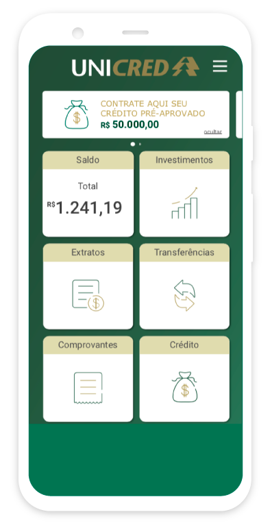
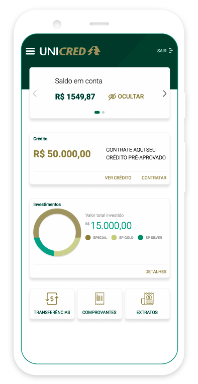
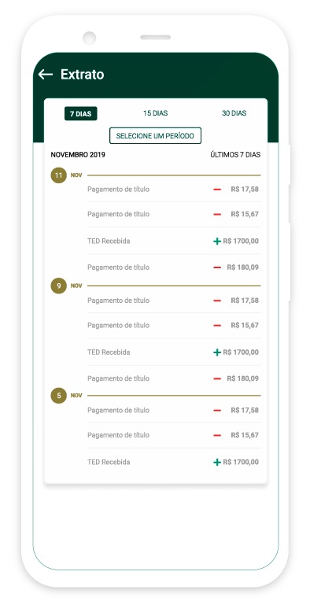

    

        <h3 class="title-section">
            Contexto
            <i class="line mt-65 mb-30"></i>
        </h3>
    

    

        <h3 class="title-second mb-30">
            Como parte de um processo seletivo fui desafiado a fazer este estudo de caso, 
            e redesenhar a interface da tela inicial,
            e de extrato do aplicativo móvel da empresa unicred.
        </h3>
        
A Unicred é uma instituição financeira cooperativa,
            cujo objetivo é fornecer crédito e prestar serviços aos
            seus cooperados.
        

    

    

        <h3 class="title-section">
            Visão Geral
            <i class="line mt-65 mb-30"></i>
        </h3>
        
Na versão oficial da loja (no momento do desafio), o app estava fora dos padrões de interface
        propostas pelo Google. Como vemos na imagem, o menu do app está a direita da tela, dificultando o 
        acesso e o entendimento do usuário. As informações dos cards estão misturadas, vemos um card com informações dinâmicas
        e outros com informações estáticas.
        

    

    

        
    

        <h3 class="title-section">
            Atualização
            <i class="line mt-65 mb-30"></i>
        </h3>
        <h3 class="title-second mb-30">
        Redesign da tela incial do aplicativo para Android
        </h3>
        
No meu redesign estou propondo uma divisão dos cards de informação, entre o
        carrossel de informações, onde encontraremos informações dinâmicas de saldo e extrato,
        em um outro card vemos um call to action para o crédito pré aprovado do usuário. Logo abaixo
        uma versão melhorada da apresentação dos investimentos sem que o usuário precise acessar outra tela
        para que veja essas informações, deixando o detalhamento dos mesmos em uma tela separada. 
        Mantive algumas funções, mais utilizadas pelos usuários, facilmente acessíveis ao usuário na área mais próxima ao toque.
        

    

    

        
    

        
    

    

        <h3 class="title-second mb-30">
            Redesign da tela de extrato do aplicativo para Android
        </h3>
        
Para simplificar a tela de extrato a proposta foi de implementar uma timeline
        com os gastos, primeiramente filtro por padrão é de sete dias, e filtros preexistentes de
        quinze e trinta dias, em conjunto no topo da timeline encontra-se um botão para filtros de
        períodos mais precisos.
        

    

    

        <h3 class="title-section">
            Comparação
            <i class="line mt-65 mb-30"></i>
        </h3>
    

    

        
    

    

        
    

    

        <i class="line" style="margin:0 auto;"></i>
    

    

